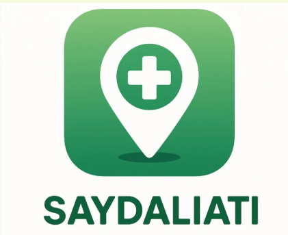
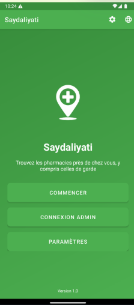
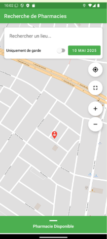
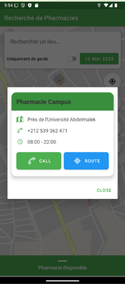

# Saydaliati - Pharmacy Locator App



**Find pharmacies near you, including those on duty**


## Overview

**Saydaliati** is a bilingual (French/Arabic) Android mobile application designed to help residents of Tangier, Morocco, easily locate nearby pharmacies, with special attention to duty pharmacies. The app provides real-time information about pharmacy locations, contact details, opening hours, and duty schedules.

## Features

### For Users
- **Interactive Map**: View all pharmacies on an interactive map with precise geolocation
- **Duty Pharmacy Filter**: Easily identify pharmacies on duty for any given date
- **Detailed Information**: Access complete pharmacy details (address, phone, hours)
- **Navigation**: Get directions to selected pharmacies
- **Direct Calling**: Call pharmacies directly from the app
- **Bilingual Interface**: Available in French and Arabic with RTL support
- **Smart Search**: Search pharmacies by name or location
- **Push Notifications**: Receive alerts about duty pharmacy changes

### For Administrators
- **Secure Login**: Protected admin interface with authentication
- **Pharmacy Management**: Add, edit, and delete pharmacy information
- **Duty Schedule Management**: Assign and manage duty periods for pharmacies
- **Calendar View**: Visual calendar interface for duty schedule management
- **Statistics Dashboard**: Monitor app usage and pharmacy data
- **Data Import/Export**: Manage pharmacy data efficiently

## Screenshots

| Home Screen | Pharmacy Search | Pharmacy Details | Admin Dashboard |
|-------------|-----------------|------------------|-----------------|
|  |  |  |  |

*More screenshots available in the `/screenshots` folder*

## Technology Stack

- **Platform**: Android (Java)
- **Architecture**: MVVM (Model-View-ViewModel)
- **Database**: Room Database (SQLite)
- **Maps**: OSMDroid (OpenStreetMap)
- **UI Framework**: Material Design Components
- **Minimum SDK**: Android 8.0 (API 26)
- **Target SDK**: Android 14 (API 34)

## Key Libraries

- **Android Architecture Components**: ViewModel, LiveData, Room
- **OSMDroid**: Open-source mapping solution
- **Material Components**: Modern UI design
- **Gson**: JSON serialization/deserialization
- **RecyclerView & CardView**: Efficient list display
- **ConstraintLayout**: Flexible responsive layouts

## Installation

### Prerequisites
- Android Studio Hedgehog | 2023.2.1 or later
- Java 11 or higher
- Android SDK 26 or higher

### Setup
1. Clone the repository:
```bash
git clone https://github.com/yourusername/saydaliati.git
cd saydaliati
```

2. Open the project in Android Studio

3. Sync the project with Gradle files

4. Build and run the application:
```bash
./gradlew assembleDebug
```

## Project Structure

```
app/
├── src/main/java/com/example/saydaliati/
│   ├── Activities/           # Activity classes
│   ├── Adapters/            # RecyclerView adapters
│   ├── Database/            # Room database components
│   │   ├── entities/        # Data entities
│   │   ├── dao/            # Data Access Objects
│   │   └── AppDatabase.java
│   ├── Models/              # Data models
│   ├── Utils/               # Utility classes
│   └── ViewModels/          # MVVM ViewModels
├── src/main/res/
│   ├── layout/              # XML layouts
│   ├── values/              # Resources (French)
│   ├── values-ar/           # Arabic resources
│   └── drawable/            # Images and icons
└── build.gradle
```

## Architecture

The app follows the **MVVM (Model-View-ViewModel)** architectural pattern:

- **Model**: Represents data sources (Room database, entities)
- **View**: UI components (Activities, Fragments, XML layouts)
- **ViewModel**: Mediates between View and Model, manages UI-related data

## Database Schema

### Main Tables

#### Pharmacies
| Column | Type | Description |
|--------|------|-------------|
| id | INTEGER | Primary key |
| name | TEXT | Pharmacy name |
| address | TEXT | Full address |
| latitude | REAL | GPS latitude |
| longitude | REAL | GPS longitude |
| phone | TEXT | Phone number |
| hours | TEXT | Opening hours |
| hasParking | BOOLEAN | Parking availability |

#### Guard Dates
| Column | Type | Description |
|--------|------|-------------|
| id | INTEGER | Primary key |
| pharmacyId | INTEGER | Foreign key to pharmacy |
| guardDate | TEXT | Duty date (YYYY-MM-DD) |
| startTime | TEXT | Start time |
| endTime | TEXT | End time |

#### Authorities
| Column | Type | Description |
|--------|------|-------------|
| id | INTEGER | Primary key |
| username | TEXT | Admin username |
| passwordHash | TEXT | Hashed password |
| role | TEXT | User role |
| lastLoginDate | TEXT | Last login timestamp |

## Development Methodology

This project was developed using **Agile methodology** with the **Scrum framework**:

- **2 Sprints** of 2 weeks each
- **Daily stand-ups** for progress tracking
- **Sprint reviews** with stakeholders
- **Retrospectives** for continuous improvement

## Localization

The app supports **bilingual functionality**:

- **French**: Default language
- **Arabic**: Full RTL (Right-to-Left) support
- All strings externalized in resource files
- Culturally appropriate translations validated by native speakers

## Security Features

- **Secure Authentication**: SHA-256 password hashing for admin accounts
- **Session Management**: Token-based session handling
- **Data Encryption**: EncryptedSharedPreferences for sensitive data
- **Input Validation**: SQL injection prevention
- **Permission Management**: Runtime permission handling

## Testing

The application has been tested for:
- **Functionality**: All features work as expected
- **Performance**: Smooth operation on devices with limited resources
- **Usability**: Intuitive interface validated by user testing
- **Security**: Authentication and data protection verified

## Contributing

1. Fork the repository
2. Create a feature branch (`git checkout -b feature/AmazingFeature`)
3. Commit your changes (`git commit -m 'Add some AmazingFeature'`)
4. Push to the branch (`git push origin feature/AmazingFeature`)
5. Open a Pull Request

## Future Enhancements

- **Medication Reservation**: Allow users to reserve medications
- **Extended Coverage**: Expand to other Moroccan cities
- **Social Features**: User reviews and ratings
- **Accessibility**: Advanced accessibility features
- **Integration**: Connect with other health services
- **iOS Version**: Develop iOS counterpart

## Team

This project was developed by students from the **Faculty of Science and Technology of Tangier (FST)** as part of their **Mobile Development** course:

- **Aymane Zian**
- **Nada Cherki** 
- **Imane Khoussi**

**Supervisor**: Mme Hafida KHALFAOUI

## License

This project is licensed under the MIT License - see the [LICENSE](LICENSE) file for details.

## Acknowledgments

- **Abdelmalek Essaadi University** for providing the educational framework
- **FST Tangier** for the technical resources and support
- **OpenStreetMap** contributors for the mapping data
- The Android development community for excellent documentation and tools

---

Made with ❤️ for the healthcare community of Tangier
